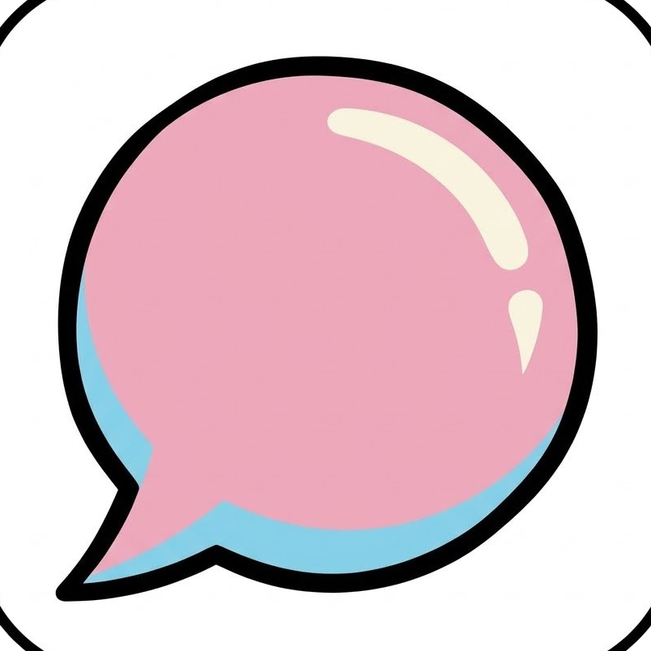
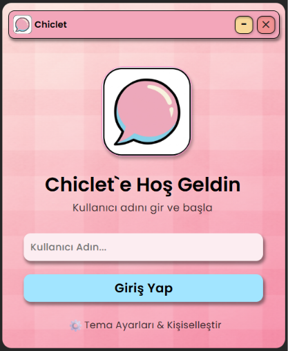
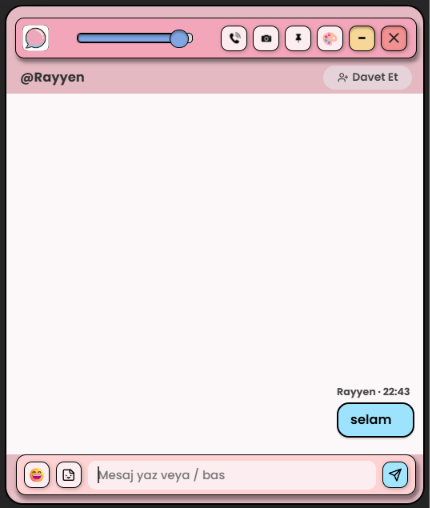
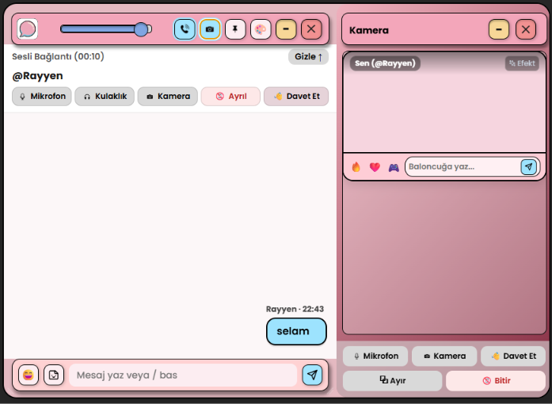
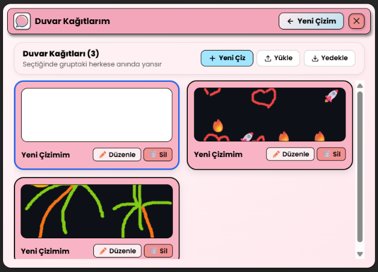
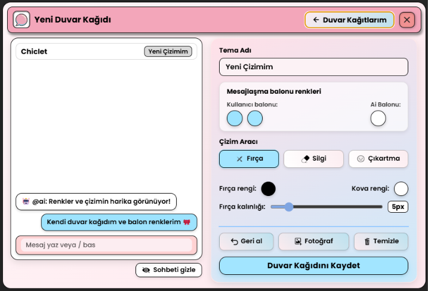

# Chiclet 🎀

<p align="center">
  
</p>

<p align="center">
  <b>Masaüstünde oyun oynarken veya çalışırken arkadaşlarınızla kesintisiz iletişim kurabileceğiniz şık, özelleştirilebilir ve WebRTC tabanlı P2P sohbet uygulaması.</b>
</p>

<p align="center">
  <a href="#özellikler">Özellikler</a> •
  <a href="#ekran-görüntüleri">Ekran Görüntüleri</a> •
  <a href="#kullanılan-teknolojiler">Teknolojiler</a> •
  <a href="#kurulum">Kurulum</a> •
  <a href="#lisans">Lisans</a>
</p>

---

## 📸 Ekran Görüntüleri

<p align="center">
  
  &nbsp;&nbsp;
  
</p>

<p align="center">
  
</p>

<p align="center">
  
  &nbsp;&nbsp;
  
</p>

---

## ✨ Özellikler

* **Uçtan Uca P2P Mesajlaşma:** Sunucusuz, PeerJS / WebRTC üzerinden doğrudan eşler arası hızlı iletişim.
* **Sesli İletişim:** Mikrofon susturma, sağırlaştırma ve çağrı sonlandırma özelliklerine sahip sesli arama paneli.
* **Görüntülü İletişim:** Dahili kamera yayını, katılımcı ekranları ve pencereleri ayırıp bağımsız hareket ettirebilme (Picture-in-Picture).
* **Özel Duvar Kağıdı Stüdyosu:** Kendi duvar kağıdınızı çizebileceğiniz tuval; fırça, silgi, kova dolgusu, kalınlık ayarı, çıkartmalar ve fotoğraf yükleme desteği.
* **Kişiselleştirilebilir Mesaj Baloncukları:** Kullanıcı ve AI mesaj balonları için degrade renk seçimi.
* **Canlı Tema Senkronizasyonu:** Oluşturulan veya seçilen duvar kağıtları gruptaki tüm katılımcılara anında yansır.
* **HUD Simge Modu:** Tek tıkla masaüstünde yüzen şeffaf konuşma balonu simgesine küçülme.
* **Saydamlık & Sabitleme Kontrolleri:** Slider ile pencere şeffaflığını ayarlayabilme ve pencereyi her zaman en üstte tutma (Pin).
* **Yapay Zekâ Asistanı (@ai):** Sohbet esnasında sorularınızı yanıtlayan yapay zekâ entegrasyonu.
* **Emoji ve Çıkartma Kütüphanesi:** Zengin emoji kategorileri ve hızlı çıkartma gönderimi.

---

## 🛠️ Kullanılan Teknolojiler

* **Electron** — Masaüstü uygulama çatısı
* **React 18** — Kullanıcı arayüzü ve bileşen mimarisi
* **Vite** — Hızlı derleme ve geliştirme ortamı
* **PeerJS / WebRTC** — Eşler arası (P2P) ses, video ve veri iletimi
* **Lucide React** — Modern arayüz ikonları
* **Web Audio & MediaStream API** — Gerçek zamanlı mikrofon ve kamera yönetimi

---

## 📁 Proje Yapısı

```text
chiclet/
├── main.cjs              # Electron ana süreç yapılandırması
├── package.json          # Bağımlılıklar ve derleme betikleri
├── public/               # İkonlar ve statik varlıklar
├── screenshots/          # README ekran görüntüleri
└── src/
    ├── App.jsx           # Ana uygulama bileşeni
    ├── index.css         # Global CSS ve animasyonlar
    ├── components/       # UI bileşenleri (Header, Chat, Voice, Video, Studio)
    └── services/         # WebRTC (P2PService) ve Tema yönetimi (ThemeService)
```

---

## 🚀 Kurulum ve Çalıştırma

### Gereksinimler

* [Node.js](https://nodejs.org/) (v18 veya üzeri)
* npm veya yarn

### Adımlar

```bash
# Projeyi klonlayın
git clone https://github.com/Raenyy/chiclet.git

# Proje dizinine girin
cd chiclet

# Bağımlılıkları yükleyin
npm install

# Geliştirici modunda başlatın
npm run electron:dev
```

### Windows Taşınabilir Sürüm Oluşturma (.exe)

```bash
npm run electron:build
```
Oluşturulan taşınabilir `.exe` dosyası `dist_electron` dizininde yer alacaktır.

---

## 📄 Lisans

Bu proje [MIT](LICENSE) lisansı altında sunulmaktadır.